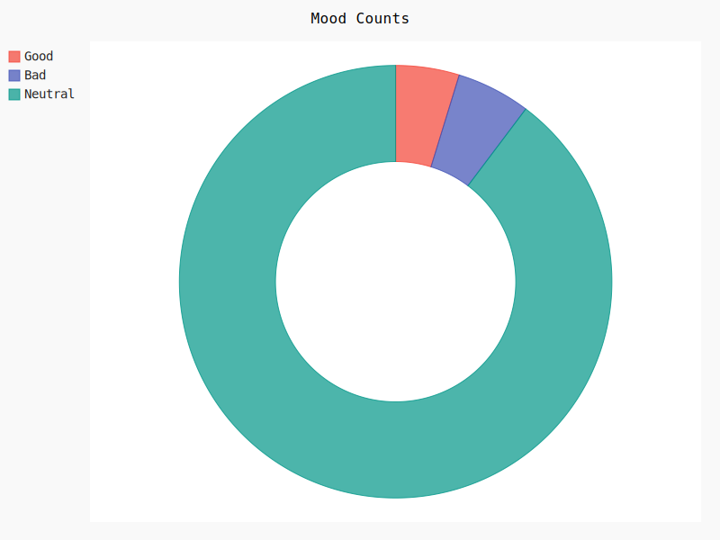
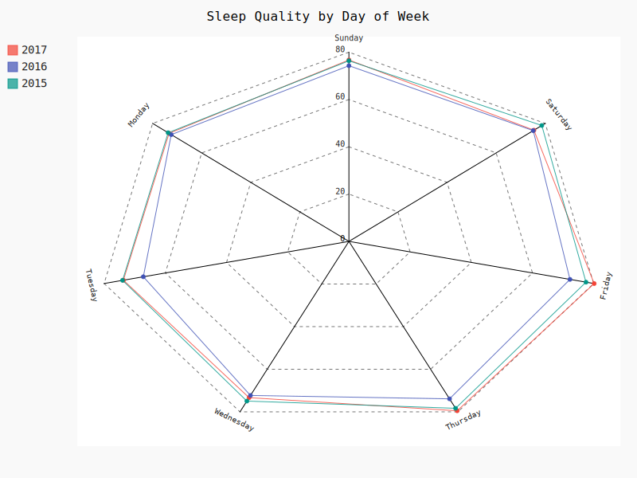
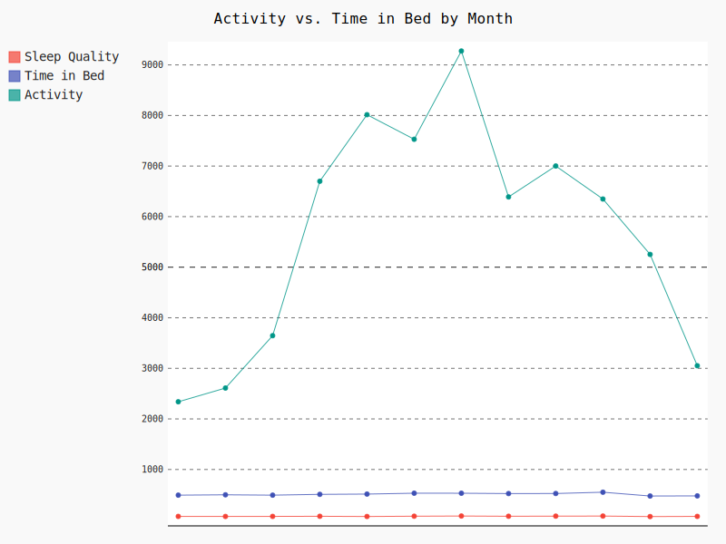

# Project 2 - Sleep Data

## Introduction

This folder contains all data files and code for analyzing my personal sleep data, which is for the DATA 550 class at Mercyhurst University in Erie, PA for the Masters in Data Science graduate program.

## The Data


The data for this project has been collected via an app on my personal iPhone since January 21, 2015.  The app being used is called [Sleep Cycle](https://www.sleepcycle.com/). I originally started using this application because of it's smart alarm clock feature. This feature will smartly wake you up based on the quality of sleep you are currently experiencing. This helps eliminate the harsh wake up a traditional alarm clock provides by determining if you are not in a deep sleep.

Additionally, this app collects the quality of your sleep throughout the night. Using the iPhone's microphone, it can detect movements. Previously, the app used the accelerometer and measured the movement of your mattress, as it was placed hear your head. Using the microphone provides greater accurracy by both eliminating the movements of your partner and the firmness or softness of your mattress.

The data was exported on October 10, 2017 via the application and is saved as ```sleepdata.csv```. Other data is collected via the app (such as geolocation, weather, snore data, etc.), but is not available through the data export within the app.

### Data Fields

The data that is available via the app's export are:

+ **Start** - the start date and time of the sleep tracking
+ **End** - the end date and time of the sleep tracking
+ **Sleep quality** - a score that represents how good the sleep was (0-100 percentage scale)
+ **Time in bed** - the amount of time
+ **Wake up** - an optional field the app allows to add a quick "mood" indicator upon waking up
+ **Sleep Notes** - an optional field the app allows the user to enter notes upon going to bed that can later be looked at to find a correlation between sleep patterns and daily activities
+ **Heart rate** - an optional field that tracks the user's heart rate upon waking up
+ **Activity (steps)** - the number of steps recorded by the iPhone for the day

### Scrubbing the Data

For this project, there will be a fair amount of data cleaning and scrubbing. First off, every other row in the CSV file is an empty line, so we might have to eliminate those. 

Secondly, the **Wake up** field was not used until Junary 13, 2016. For the purposes of this project, any date that does not have a sleep note will be given the *neutral* value. We could eliminate those dates altogether, but that does chop our data selection by nearly a third.

Finally, we will need to manipulate some columns into proper data types to make our queries and visualizations easier to manage. The **Sleep Quality** field will also be updated to remove the percentage sign (%).

### Exploring the Data

The file ```sleep-data.ipynb``` contains several queries against our data so we can determine how we want to visualize it. The ideas I explored are:

+ Which day of the week gives the best sleep quality?
+ How has my sleep quality changed since losing my job on June 5, 2017?
+ Do summer months provide better sleep quality since I am generally more active?
+ Do step counts affect sleep quality?
+ How much sleep do I average a night?

### Visualizing the Data

A series of visualizations is provided in ```sleep-charts.ipynb```. These charts will help answer some of the questions posed above.

## Conclusions

After cleaning the data, and removing 4 rows that recorded 0 minutes of sleep, I average about 437 minutes of sleep (7 hours and 17 minutes) per night. The least amount of sleep I've gotten in a night was 42 minutes, and the most I've gotten was 716 minutes (11 hours and 56 minutes). 

Of the 905 nights tracked, only 50 were marked as *Bad*, 43 as *Good*, and the remaining 812 as *Neutral*. Because of this, we can eliminate the **Mood** statistic as irrelevant. This is because most mornings I just hit the *Neutral* option by default.

### Sleep Quality by Mood



Mood | Avg | Low | High
--- | ---: | ---: | ---:
Bad | 67.3% | 9.0% | 100%
Neutral | 74.7% | 10.0% | 100%
Good | 81.8% | 55.0% | 100%

Again, the **Mood** statistic can be eliminated as untrustworthy, as I have had a night with 100% sleep quality, yet marked it as a *Bad* wake up. However, the average ratings are interesting.

### Sleep Quality by Day of Week



Day of Week | Avg | Low
--- | ---: | ---:
Sunday | 75.6% | 39.0%
Monday | 73.1% | 36.0%
Tuesday | 71.2% | 9.0%
Wednesday | 73.6% | 18.0%
Thursday | 76.9% | 40.0%
Friday | 76.1% | 41.0%
Saturday | 76.3% | 10.0%

Tuesdays appear to be my worst night for sleep. Personally, I'm not shocked by this because I normally have either a soccer league or golf league on that night. Typically after league is done, I am at the bar with friends, and the nights can go until hours.

### Activity vs. Sleep Quality



From the above chart, it does not appear that how much activity I had during the day affects my time in bed or the quality of my sleep.

### Employed vs. Unemployed vs. Student

Status | Nights | Avg Quality | Lowest Quality
--- | ---: | ---: | ---:
Employed | 784 | 79.7% | 31.0%
Unemployed | 75 | 80.3% | 37.0%
Student | 46 | 79.3% | 31.0%

Filtering by date ranges, it's obvious that I got better sleep when unemployed. This is probably due to the high amounts of stress I dealt with on a daily basis at my previous job. With that being said, I should look into continuing this whole not having to work thing :)


