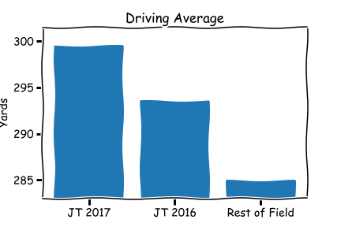
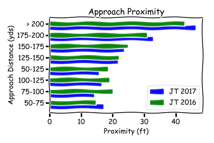
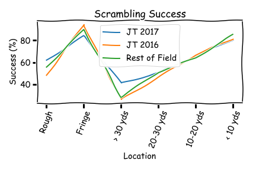
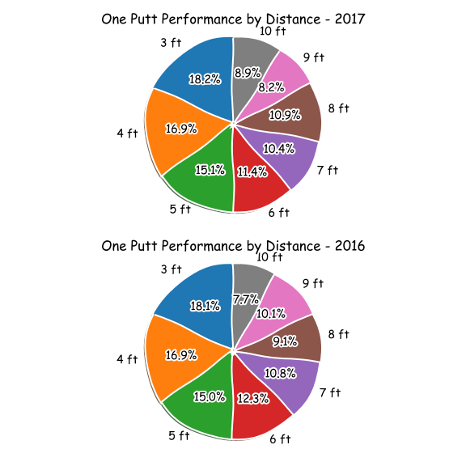
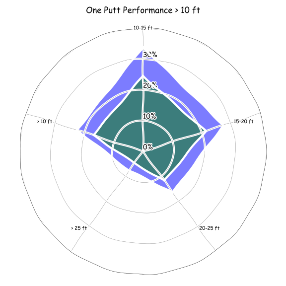
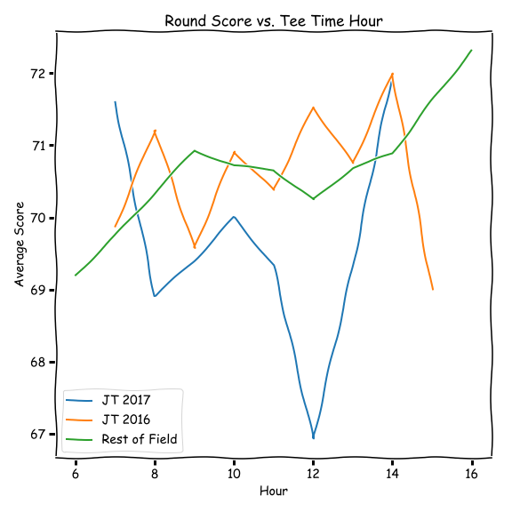

# Project 3 - What Makes a PGA Tour Player of the Year Season?

## Introduction

This folder contains all data files and code for analyzing both the 2016 and 2017 golf seasons for professional golfer Justin Thomas, which is for the DATA 550 class at Mercyhurst University in Erie, PA for the Masters in Data Science graduate program.

## Objective

For this project, we want to find out what statistics were improved for Justin Thomas between 2016 and 2017.  Looking at the [supplied statistics for Justin Thomas](https://www.pgatour.com/players/player.33448.justin-thomas.html), we see that in 2016 he only won once, and finished 12th in the FedEx Rankings. In 2017, he won 5 times (one of which was a major tournament), finished 2nd in the FedEx Rankings, won the FedEx Cup Playoffs, and more than doubled his official money earnings. 

Year | Events Played | Wins | Top 10s | Missed Cuts | Win % | Cut %
--- | ---: | ---: | ---: | ---: | ---: | ---:
2017 | 25 | 5 | 12 | 6 | 20.0% | 24.0%
2016 | 28 | 1 | 7 | 6 | 3.5% | 21.4%
2015 | 30 | 0 | 7 | 7 | 0.0% | 23.3%

In an article in the November 2017 issue of Golf Digest, Thomas noted that "the big difference was working hard on my putting consistency" and that he "worked hard on putts over 10 feet". This project will investigate his targeted practice on putting and compare it with a variety of other stats that could have been a difference maker.  

## The Data

The data for this project comes via the [PGA Tour Shotlink Intelligence System](https://www.pgatour.com/stats/shotlinkintelligence/overview.html). In August 2017, I applied for and was given access to the data available. The particular set of data I will be using is the Round Details. I downloaded the full data for the 2016 and 2017 seasons for every player and every official tournament. These files are semicolon delimited text files and are named ```rround-2016.txt``` and ```rround-2017.txt```.

Within these files there are 176 columns of data and the definitions of which can be found in the [definitions file](Round Detail Field Defs.pdf).

## Cleaning and Parsing the Data

After filtering out only Justin Thomas's rounds from both the 2016 and 2017 files, a quick look at the "Round Score" field shows some interesting results for 2017.

```python
jt2017['Round Score'].describe()

count    86.000000
mean     68.558140
std       5.844262
min      36.000000
25%      67.000000
50%      69.000000
75%      71.000000
max      80.000000
Name: Round Score, dtype: float64
```

Any follower of golf will see that a minimum score of 36 for 18 holes of golf is not plausible. The official lowest round of golf on the PGA Tour is 58. Filtering out any Round Score less than 58 shows 2 rounds for the same tournament, the Zurich Classic of New Orleans. This tournament followed a less traditional scoring format. This was a team event, and the 2nd and 4th rounds of golf were in the four-ball format (i.e. best ball). This format has both players playing their own ball to completion, but the official score uses the best of the two player's scores. Because of this format, the Round Score for these two rounds can be eliminated from the data, leaving the following:

```python
jt2017 = jt2017[(jt2017["Round Score"] >= 58)]
jt2017["Round Score"].describe()

count    84.000000
mean     69.250000
std       3.721883
min      59.000000
25%      67.000000
50%      69.000000
75%      71.000000
max      80.000000
Name: Round Score, dtype: float64
```

Now we have a more accurate representation of his season, with those two rounds altering his average score by 0.7 strokes.


## Comparing Seasons

The file ```stats-compare.ipynb``` contains a breakdown of several key statistics and compares Justin's 2017 and 2016 seasons, along with the rest of the field in 2017. From this file, we can quickly see which statistics showed improvements, and which showed declines. Items in **bold** denote a significant change.

Statistic | 2017 | 2016 | Field | Better/Worse
--- | ---: | ---: | ---: | ---
Driving Accuracy | 54.9% | 53.9% | 60.5% | Better
Driving Average | 299.4 yds | 293.5 yds | 284.9 yds | **Better**
Proximity from 50-75 yds | 16.9 ft | 14.6 ft | 17.5 ft | Worse
Proximity from 75-100 yds | 14.1 ft | 19.8 ft | 18.1 ft | **Better**
Proximity from 100-125 yds | 16.3 ft | 18.7 ft | 20.4 ft | Better
Proximity from 50-125 yds | 15.4 ft | 18.4 ft | 19.3 ft | **Better**
Proximity from 125-150 yds | 21.6 ft | 22.0 ft | 23.4 ft | Better
Proximity from 150-175 yds | 23.7 ft | 24.9 ft | 27.9 ft | Better
Proximity from 175-200 yds | 32.7 ft | 30.7 ft | 33.6 ft | Worse
Proximity from > 200 yds | 46.2 ft | 42.7 ft | 50.6 ft | **Worse**
Greens in Regulation | 67.1% | 65.6% | 64.9% | Better
Scrambling Success | 61.8% | 55.8% | 58.5% | **Better**
Scrambling Proximity | 8.1 ft | 8.4 ft | 8.7 ft | Worse
Scrambling from Rough | 61.9% | 48.1% | 55.5% | **Better**
Scrambling from Fringe | 83.8% | 94.4% | 89.7% | **Worse**
Scrambling from > 30 yds | 40.9% | 25.9% | 28.2% | **Better**
Scrambling from 20-30 yds | 50.3% | 46.2% | 51.0% | Better
Scrambling from 10-20 yds | 65.4% | 66.8% | 64.0% | Worse
Scrambling from < 10 yds | 80.6% | 81.3% | 85.0% | Worse
Putts per Hole | 1.56 | 1.62 | 1.61 | Better
Putts per Hole (GIR) | 1.13 | 1.16 | 1.15 | Better
One Putt Average | 43.6% | 37.8% | 38.8% | **Better**
Three Putt Avoidance | 2.6% | 3.0% | 3.1% | Better
Putts from 3 ft | 99.5% | 99.5% | 99.4% | No Change
Putts from 4 ft | 92.2% | 92.8% | 91.8% | Worse
Putts from 5 ft | 82.2% | 82.7% | 80.9% | Worse
Putts from 6 ft | 62.3% | 67.6% | 70.4% | Worse
Putts from 7 ft | 56.8% | 59.4% | 60.9% | Worse
Putts from 8 ft | 59.2% | 49.9% | 53.4% | **Better**
Putts from 9 ft | 44.8% | 55.4% | 45.5% | **Worse**
Putts from 10 ft | 48.3% | 42.5% | 41.4% | Better
Putts from < 10 ft | 87.6% | 88.7% | 87.7% | Worse
Putts from > 10 ft | 22.5% | 17.0% | 18.7% | **Better**
Putts from 4-8 ft | 69.2% | 67.5% | 68.7% | Better
Putts from 10-15 ft | 33.8% | 24.4% | 30.4% | **Better**
Putts from 15-20 ft | 27.4% | 21.3% | 18.6% | **Better**
Putts from 20-25 ft | 16.4% | 11.8% | 12.3% | **Better**
Putts from > 25 ft | 7.6% | 4.7% | 5.2% | **Better**


## Off the Tee Analysis

Justin Thomas's driving average improved by nearly 6 yards in 2017. For the courses Justin played in 2017 versus 2016, the average yardage of the courses went up by 15 yards, so this increased distance likely contributed to his success.



## Approach Analysis

Approach proximity is the measurement of how close to the hole the ball ends up on the approach shot. The approach shot is defined as the shot number that is 2 strokes less than par.  So, for a par 3 hole, the approach shot is the 1st shot. On a par 4 hole, the approach shot is the 2nd shot, and lastly, on a par 5 hole, the approach shot is the 3rd shot. 

In 2017, Justin Thomas increased his approach proximity from 75-100 yards by over 5 feet. This results in much shorter birdie putts. From 2003 to 2012, a PGA Tour professional would make a 5 foot putt 77% of the time.  A 10 foot putt went in only 40% of the time. By reducing how far you have to putt for a birdie, you increase your chances of making it.  This is definitely shown in the stats where Thomas increased his one-putt average from 37.8% to 43.6%.



## Short Game Analysis

Hitting a green in regulation (GIR) means that your approach shot ended up on the green and that your first putt will be for birdie. This helps a golfer's chances of making a birdie since having to use a club other than a putter to get the ball in the hole can be much more difficult than using a putter.  A missed GIR means that the golfer will have to "scramble" to make par. This means having to get the ball in the hole in two shots or less and ending up with bar. This typically requires a short pitch shot or chip shot and then one putt. Getting that short shot close to the hole greatly increases the chances of making the putt for par.

In 2017, Justin Thomas got considerably better at scrambling from over 30 yards, which lifted his overall scrambling success rate. Interestingly enough, he got worse when having to scramble from the fringe (e.g. short grass surrounding the green) versus a massive improvement from the rough (e.g. longer, thicker, un-mowed grass).

These shots from over 30 yards and saving par was leaps and bounds better than 2016 and the rest of the field (41% compared to 26-28% success). Being able to save par from a missed GIR definitely is a competitive advantage.



## Putting Analysis

For putts between 3 feet and 10 feet, Thomas improved at 8 feet by almost 10%, however, at 9 feet, he declined by roughly the same (55% to 44%). This does not appear to be a factor between seasons.



However, when we look at putts over 10 feet, we see some major improvements. Thomas improved in every category outside of 10 feet. Considering the a one putt from 8 feet is only 50%, being able to make putts longer than that can greatly help compared to other golfers.



## Miscellaneous Analysis

Another factor for scores could be when the players tee off during the day. Tee times usually range between 6am and 5pm. Thomas tends to play his best golf when he tees off 12pm and 1pm.



## Conclusion

Using these visualizations, we can see that Justin Thomas really improved his long putting from 2016 to 2017. This follows his comments in Golf Digest where he said he focused on that a lot.